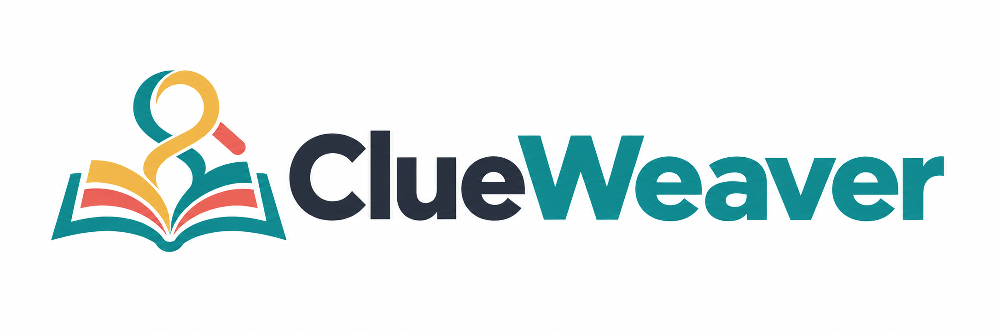
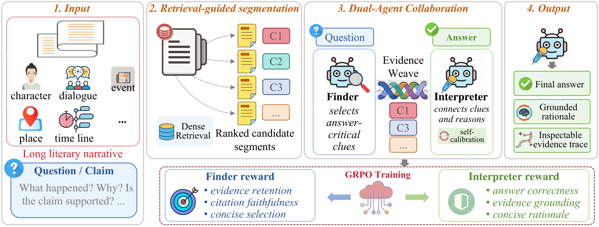
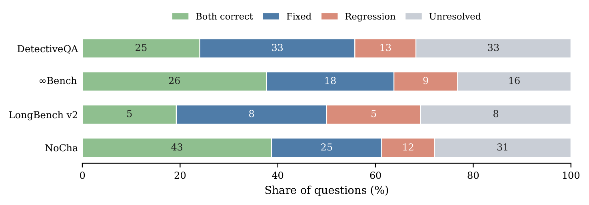
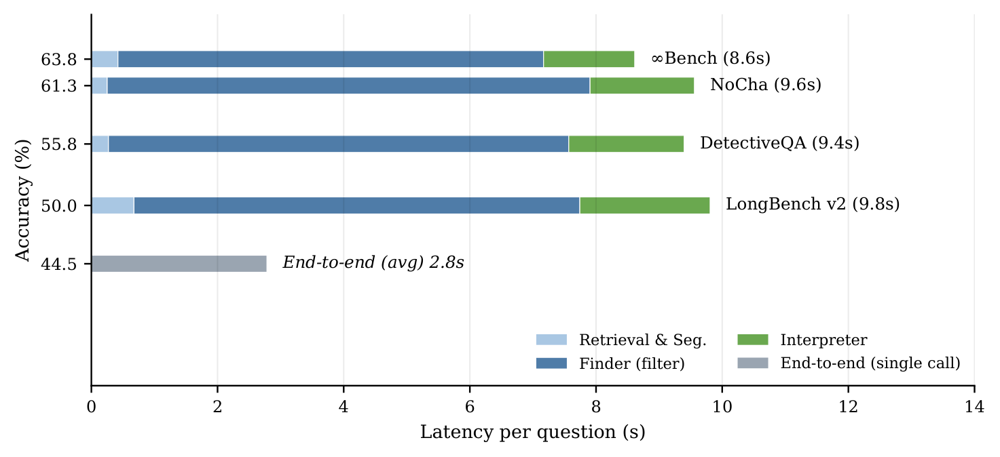

<div align="center">



# ClueWeaver

### Reward-Guided Dual-Agent Evidence Reasoning for Compact LLMs on Literary Long Narratives

**Accepted at ICONIP 2026**

[](https://arxiv.org/abs/2608.25531)
[](https://huggingface.co/Ameame1002/ClueWeaver)
[](https://ameame1.github.io/ClueWeaver/)

</div>

## Overview

ClueWeaver is an evidence-aware dual-agent framework for long-narrative question answering with compact local models. It addresses a closed-document setting: the narrative is already given, but answer-critical clues can be sparse and far apart.

The **Finder** selects clue-bearing passages from retrieval-guided segments. The **Interpreter** connects the selected evidence into an answer with paragraph-ID citations, and performs internal self-calibration for high-risk questions. Both agents use **Qwen3-4B-Instruct** and are trained separately with reward-guided **GRPO**.

<p align="center">
  
</p>

*ClueWeaver framework from the paper. Self-calibration is a mode of the Interpreter, not a third agent.*

## Method

1. **Retrieval-guided segmentation.** Dense retrieval with BGE-M3 and lexical matching identify candidate passages while preserving paragraph IDs and surrounding context.
2. **Finder: evidence selection and rationale generation.** Each segment receives a YES/NO clue decision and a short rationale with supporting paragraph references.
3. **Evidence packing.** Selected evidence is compacted and ordered by its position in the narrative.
4. **Interpreter: evidence-grounded interpretation.** The Interpreter predicts the answer from the evidence packet. For binary claims and high-risk question forms, it can re-check its provisional answer against the same evidence.

The Finder reward emphasizes evidence retention and faithful paragraph references. The Interpreter reward emphasizes answer correctness, grounding, and concise explanations. See Sections 3.4-3.5 and Appendix A of the [paper](https://arxiv.org/abs/2608.25531).

## Results

Final answer accuracy (%) from Table 1 of the paper, evaluated on **310 questions**: DetectiveQA (104), InfiniteBench (69), LongBench v2 (26), and NoCha (111). Overall accuracy is weighted by question count.

| Method | DetectiveQA | InfiniteBench | LongBench v2 | NoCha | Overall |
|---|---:|---:|---:|---:|---:|
| **End-to-end reader (Local)** | | | | | |
| Qwen3-4B-Instruct | 36.5 | 50.7 | 38.5 | 49.5 | 44.5 |
| Qwen3-8B | 45.2 | 56.5 | 26.9 | 55.0 | 49.7 |
| Ministral-3-14B | 45.2 | 60.9 | 26.9 | 51.4 | 49.4 |
| GPT-OSS-20B | 30.8 | 33.3 | 34.6 | 50.5 | 38.7 |
| Qwen3-30B-A3B | 44.2 | 58.0 | 38.5 | 54.1 | 50.3 |
| Gemma-4-31B-it | 35.6 | 58.0 | 46.2 | 59.5 | 50.0 |
| **End-to-end reader (API)** | | | | | |
| Claude Haiku 4.5 | 62.5 | 73.9 | 38.5 | 64.9 | 63.9 |
| GPT-5 nano | 62.5 | 76.8 | 26.9 | 60.4 | 61.9 |
| **Agentic pipelines** | | | | | |
| ReAct | 50.0 | 50.7 | 38.5 | 58.6 | 52.3 |
| IRCoT | 53.8 | 44.9 | 34.6 | 60.4 | 52.6 |
| Self-Ask | 36.5 | 49.3 | 19.2 | 59.5 | 46.1 |
| Chain-of-Agents | 27.9 | 46.4 | 38.5 | 55.9 | 42.9 |
| RAG-DDR | 47.1 | 53.6 | 30.8 | 59.5 | 51.6 |
| **ClueWeaver** | **55.8** | **63.8** | **50.0** | **61.3** | **59.0** |

ClueWeaver improves overall accuracy by **14.5 percentage points** over the Qwen3-4B end-to-end reader and **6.4 points** over the strongest local baseline overall, IRCoT. API end-to-end readers remain stronger overall. Local end-to-end readers use a 32K context budget; API readers use 128K. Baseline implementations and training differences are described in Appendix C.

### Error Analysis

<p align="center">
  
</p>

*Fixed: reader wrong, ClueWeaver correct. Regression: reader correct, ClueWeaver wrong. Segment labels are question counts; bar widths show percentages.*

### Efficiency

<p align="center">
  
</p>

*Paper measurements using Qwen3-4B on a single GPU with serial execution. The end-to-end reader is shown as an average; ClueWeaver timings are shown per benchmark. Most additional latency comes from the Finder.*

## Code and Models

| Component | Location |
|---|---|
| Pipeline orchestration | [src/agent/pipeline.py](src/agent/pipeline.py) |
| Retrieval and segmentation | [src/agent/segmenter.py](src/agent/segmenter.py) |
| Finder | [src/agent/finder.py](src/agent/finder.py) |
| Interpreter and self-calibration | [src/agent/interpreter.py](src/agent/interpreter.py) |
| GRPO reward functions | [src/training/rewards/plugin.py](src/training/rewards/plugin.py) |
| OpenAI-compatible local client | [src/llm_client.py](src/llm_client.py) |
| Single-question command | [scripts/run_question.py](scripts/run_question.py) |
| Input examples | [examples/](examples/) |
| Reproduction and verification | [docs/reproducibility.md](docs/reproducibility.md) |
| Finder weights | [Hugging Face / Finder](https://huggingface.co/Ameame1002/ClueWeaver/tree/main/Finder) |
| Interpreter weights | [Hugging Face / Interpreter](https://huggingface.co/Ameame1002/ClueWeaver/tree/main/Interpreter) |

Each model directory contains full weights, configuration, and tokenizer files. The [reproduction guide](docs/reproducibility.md) describes the release scope, checked behavior, and requirements for reproducing the paper's results.

## Quick Start

### Environment and Downloads

Use Python 3.10 or newer and a PyTorch installation compatible with your CUDA environment. Run the following from the repository root:

```bash
git clone https://github.com/Ameame1/ClueWeaver.git
cd ClueWeaver
pip install -r requirements.txt
hf download Ameame1002/ClueWeaver --local-dir models/ClueWeaver
hf download BAAI/bge-m3 --local-dir models/bge-m3
```

### Serve the Agents

Use an OpenAI-compatible inference server with Qwen3 support. For example, with a recent [vLLM installation](https://docs.vllm.ai/en/latest/), run these commands in separate terminals on two available GPUs:

```bash
CUDA_VISIBLE_DEVICES=0 vllm serve models/ClueWeaver/Finder \
  --served-model-name clueweaver-finder --host 127.0.0.1 --port 8001 \
  --max-model-len 9216 \
  --default-chat-template-kwargs '{"enable_thinking": false}'
```

```bash
CUDA_VISIBLE_DEVICES=1 vllm serve models/ClueWeaver/Interpreter \
  --served-model-name clueweaver-interpreter --host 127.0.0.1 --port 8000 \
  --max-model-len 9216 \
  --default-chat-template-kwargs '{"enable_thinking": false}'
```

The commands above illustrate serving, not the paper's serial timing setup. Model-internal thinking is disabled as specified in Appendix B. The server option follows [vLLM's chat-template configuration](https://docs.vllm.ai/en/latest/api/vllm/entrypoints/launchers/cli_args/).

In the client terminal:

```bash
export QWEN_BASE=http://127.0.0.1:8000/v1
export QWEN_MODEL_NAME=clueweaver-interpreter
export QWEN_KEY=EMPTY
export QWEN_FINDER_BASE=http://127.0.0.1:8001/v1
export QWEN_FINDER_MODEL_NAME=clueweaver-finder
export QWEN_FINDER_KEY=EMPTY
export QWEN_ENABLE_THINKING=false
export QWEN_FINDER_ENABLE_THINKING=false
export BGE_M3_PATH=models/bge-m3
export RETRIEVER_DEVICE=cpu
```

The example keeps retrieval on CPU to avoid competing with the two model servers. Set `RETRIEVER_DEVICE=cuda` when GPU memory is available; the paper uses GPU-based dense retrieval.

### Run a Question

```bash
python -m scripts.run_question \
  --input examples/multiple_choice.json --output results/multiple_choice.json

python -m scripts.run_question \
  --input examples/binary_claim.json --output results/binary_claim.json
```

Replace the paragraphs and question in either example with your own input. The command returns the answer, rationale, selected evidence, and timing information. The optional `gold` field is used only for scoring, never in model prompts; unlabeled inputs return `correct: null`.

Binary claim verification requires `binary_mode=true` and **`options={}`**, with answers normalized to `TRUE` or `FALSE`. Multiple-choice inputs use the four labels `A`, `B`, `C`, and `D`. For direct Python integration, use `src.agent.pipeline.run_question`. Prompt formats and self-calibration rules are documented in Appendix E.

### Offline Checks

These checks require no GPU, model downloads, or API credentials:

```bash
python -m unittest discover -s tests -v
python -m scripts.run_question --input examples/binary_claim.json --validate-only
```

They validate input and interface behavior with mocked responses, not benchmark accuracy. See the [verification record](docs/reproducibility.md) for the tested environment and remaining reproduction requirements.

### Paper Configuration

The main results use dataset-specific evidence packing. In `(N_E, P_r, P_w, B_c)`, `N_E` is the maximum selected-segment count, `P_r` and `P_w` are paragraph budgets for retrieval-anchored and local-window segments, and `B_c` is the total character budget.

| Dataset | N_E | P_r | P_w | B_c |
|---|---:|---:|---:|---:|
| DetectiveQA | 10 | 4 | 6 | 15000 |
| InfiniteBench | 7 | 3 | 6 | 14000 |
| LongBench v2 | 8 | 4 | 6 | 15000 |
| NoCha | 10 | 6 | 8 | 16000 |

For example, the DetectiveQA packing configuration is:

```bash
export FILM_CS_EVIDENCE_MAX_SEGMENTS=10
export FILM_CS_RETRIEVAL_SEGMENT_MAX_PARAGRAPHS=4
export FILM_CS_WINDOW_SEGMENT_MAX_PARAGRAPHS=6
export FILM_CS_EVIDENCE_MAX_CHARS=15000
```

Binary tasks use `FILM_CS_BINARY_EVIDENCE_MAX_SEGMENTS` and `FILM_CS_BINARY_EVIDENCE_MAX_CHARS` for the corresponding limits. The short example above demonstrates the API; it is not a benchmark reproduction. See Appendices B-E for training, evidence construction, and prompt details.

## Acknowledgements

This research is supported by the National Key R&D Program of China (No. 2023YFC3303800). We thank [WisPaper / QiewenPaper](https://wispaper.ai) for Academic Agent support and GPU computational resources throughout the study.

## Citation

```bibtex
@misc{zhu2026clueweaver,
  title={ClueWeaver: Reward-Guided Dual-Agent Evidence Reasoning for Compact LLMs on Literary Long Narratives},
  author={Jihao Zhu and Zhiwei Yang and Wenxiao Zhang and Junqian Zhao and Qi You and Fangqi Wang and Zheyuan Deng and Hanzhe Yang and Yu Liu and Jin B. Hong},
  year={2026},
  eprint={2608.25531},
  archivePrefix={arXiv},
  primaryClass={cs.CL},
  url={https://arxiv.org/abs/2608.25531}
}
```
